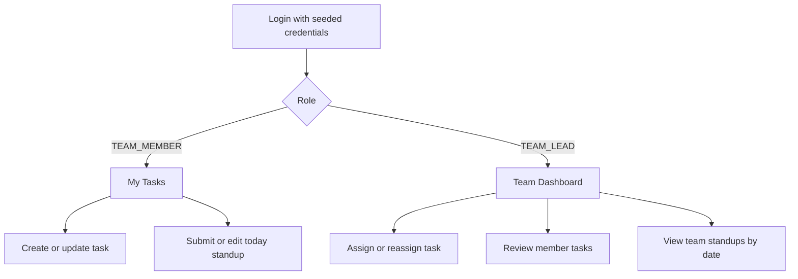

# Task Management Application — MVP Product Requirements

**Status:** MVP specification  
**Product:** Team-scoped task board + daily standup + lead dashboard  
**Not this product:** Multi-workspace collaboration, public signup, or a project-management suite

---

## Problem Statement

Team leads cannot answer two operational questions without chasing people: who is overloaded right now, and who has not reported progress today. Status lives in chat threads, spreadsheets, and memory. That makes workload invisible until it is already late.

Team members do not have a low-friction place to log work and a daily standup. Existing tools either require too much process (projects, epics, custom fields) or none at all (a group chat). Members need to create and update tasks, change status, and record Done / Doing / Blockers for the day without administrative overhead.

This MVP is a **single team per lead**. After login, a user sees a view for their role. Members work from My Tasks and today’s standup. Leads work from a team dashboard that shows workload, task status mix, completion rate, and standup presence. There are no workspaces, no self-serve onboarding, and no realtime feed. Users, roles, and team membership are seeded by a system operator.

The product succeeds when a lead can see team load and missing standups in one screen, and a member can create a task and submit today’s standup in one sitting.

---

## Target Users

### Team Member

Individual contributor on exactly one team.

They need to:

- Log in with a seeded account and land on **My Tasks**
- Create tasks, edit tasks they own or are assigned, and set status (`TO_DO`, `IN_PROGRESS`, `COMPLETED`)
- Submit or edit **today’s** standup (Done / Doing / Blockers)
- See only their own tasks and their own standup history

They do not manage other people, assign work across the team, or open the lead dashboard.

### Team Lead

Owner of exactly one team. Members of that team are attached in seed data.

They need to:

- Log in with a seeded account and land on the **Team Dashboard**
- Create tasks for the team and assign or reassign them to any team user (including themselves)
- Review every member’s tasks and update status as needed
- Read the team’s standups for a selected date
- See per-member workload, team status mix, completion rate, and who has (or has not) stood up today

The dashboard **is** the status overview. Leads do not export reports in MVP.

### System operator (out of product UI)

Not an in-app role. A developer or admin who seeds users, passwords, roles (`TEAM_LEAD` or `TEAM_MEMBER`), the team record, and membership. There is no registration, invite email, or join code in the product.

---

## Core Features

### 1. Login and role-tailored home

As a user, I can log in with seeded credentials and immediately see the home view for my role.

- Authentication uses username/email + password against seeded users.
- Successful login issues a JWT. Role is taken from the token/user record, not from the client.
- `TEAM_MEMBER` is redirected to **My Tasks** (with today’s standup reachable from that home).
- `TEAM_LEAD` is redirected to the **Team Dashboard**.
- Invalid credentials fail closed with a generic error. A member who opens a lead-only URL or API is denied (UI redirect + HTTP 403).

### 2. Task submission and management

As a Team Member or Team Lead, I can create and manage tasks on my team.

Each task has:

- Title (required)
- Description (optional)
- Status: `TO_DO` | `IN_PROGRESS` | `COMPLETED` (required; default `TO_DO`)
- Assignee (required; must be a user on the same team)
- Optional due date
- Creator (set by the server)
- Timestamps (created/updated, set by the server)
- Team (set by the server from the authenticated user’s team)

**Who can create:** both roles. The new task belongs to the creator’s team.

**Who can edit or change status:**

- Member: tasks they created **or** tasks assigned to them, on their team only
- Lead: any task on their team

**Who can assign / reassign:**

- Lead: any team user, including themselves
- Member: may set assignee to themselves when creating; may not assign a task to another person

**Who can delete:**

- Lead: any task on their team
- Member: only tasks they created that are **not** assigned to someone else

Members list and open only their own relevant tasks (created by them or assigned to them). Leads list and open all tasks on the team. Filtering by member and status is required on the lead task list.

### 3. Daily standup

As a Team Member, I can record one standup per calendar day that is **not** tied to a single task.

Each standup entry has:

- Done (plain text)
- Doing (plain text)
- Blockers (plain text)
- Author (server-set)
- Team (server-set)
- Calendar date in UTC (server-set on create; one row per user per UTC date)

Rules:

- A member can create or edit **today’s** entry only (UTC). Past days are read-only for the author.
- Submitting again today updates the existing row; it does not create a duplicate.
- A member can view their own standup history.
- A lead can read all team standups for a selected date and see who is missing for that date.
- No comments, reactions, or task links on standups.

### 4. Team progress dashboard

As a Team Lead, I can open one screen and see team load and progress.

The dashboard shows:

- **Per-member active workload:** counts of `TO_DO` and `IN_PROGRESS` tasks
- **Team status mix:** counts of `TO_DO`, `IN_PROGRESS`, and `COMPLETED`
- **Completion rate:** share of tasks moved to `COMPLETED` in the last 7 days (based on last status change / updated time for completed tasks)
- **Standup presence for today (UTC):** submitted vs missing, per team member (lead included if they are expected to stand up as a team user; if the lead has no standup requirement in seed data, still show members)

This in-app dashboard is the status overview. There is no PDF, CSV, or email digest.

Dashboard numbers refresh on a normal page load / explicit reload of the dashboard request. Live push is out of scope.

### 5. Role-based access control

As a user, I only see and change data my role allows. The API enforces this; hiding buttons in the UI is not enough.

| Action | Team Member | Team Lead |
| --- | --- | --- |
| Log in | Yes | Yes |
| View own tasks (created or assigned) | Yes | Yes (and all team tasks) |
| Create a task on own team | Yes | Yes |
| Assign/reassign to another team user | No | Yes |
| Edit/status any team task | No | Yes |
| Delete another person’s task | No | Yes |
| Submit/edit own standup for today | Yes | Yes (own entry only) |
| Read another user’s standup | No | Yes (own team, by date) |
| View team dashboard aggregates | No | Yes |

A member calling lead-only endpoints (dashboard aggregates, another user’s tasks, another user’s standup) receives **403**. Cross-team access is impossible in MVP because each user belongs to one team; requests must still be scoped by `team_id` from the authenticated user, never from a client-supplied team override.

### Out of scope (MVP)

Do not implement:

- Public registration, email invites, join codes, password reset, or email of any kind
- Multiple teams per user, multiple teams per lead, or workspaces
- Comments, attachments, notifications, @mentions
- WebSockets / live updates
- Report export (PDF/CSV), printed status reports
- Hourly time tracking or task-level percent complete
- Custom statuses, labels, epics, sprints, or projects-within-the-team
- OAuth / SSO

---

## User Flows

### Flow 1 — Login

1. User opens the web app and submits seeded username/email and password.
2. API validates credentials and returns a JWT plus role and display name.
3. Client stores the token and routes:
   - `TEAM_MEMBER` → My Tasks
   - `TEAM_LEAD` → Team Dashboard
4. Subsequent API calls send the JWT. Expired/invalid tokens return 401 and the client returns to login.

**Failure:** Wrong password or unknown user → login fails, no token, generic error. No account enumeration beyond what the seeded demo already implies.

### Flow 2 — Member creates or updates a task

1. Member is on My Tasks and chooses create.
2. Member enters title, optional description, optional due date. Assignee defaults to self. Status defaults to `TO_DO`.
3. API creates the task on the member’s team with creator = current user.
4. Member later opens that task (or one assigned to them), edits fields they are allowed to change, and/or sets status to `IN_PROGRESS` or `COMPLETED`.
5. My Tasks list reflects the new status after save.

**Failure:** Empty title → validation error (400). Member attempts to assign to another user → 403. Member opens another member’s task by ID → 403.

### Flow 3 — Member submits today’s standup

1. From member home, member opens today’s standup.
2. If no row exists for this user + today’s UTC date, they fill Done / Doing / Blockers and submit (create).
3. If a row already exists, the form shows it; submit updates the same row.
4. Member can reopen today’s form and edit until the UTC date rolls over.
5. Previous days appear in history as read-only.

**Failure:** Second create for the same UTC day is treated as an upsert, not a duplicate row. Edit of a past day’s standup → 403. **MVP rule:** at least one of Done / Doing / Blockers is required, otherwise 400.

### Flow 4 — Lead assigns or reassigns a task

1. Lead creates a task or opens an existing team task.
2. Lead sets assignee to a user on the team (or themselves) and saves.
3. The task appears in that member’s My Tasks and in the lead’s team task list.
4. Workload counts on the dashboard include the assignee’s `TO_DO` / `IN_PROGRESS` totals after reload.

**Failure:** Assignee is not on the lead’s team → 400. Member tries the same assign API → 403.

### Flow 5 — Lead reviews dashboard and standups

1. Lead lands on Team Dashboard after login (or navigates back to it).
2. Dashboard loads per-member workload, team status mix, 7-day completion rate, and today’s standup presence.
3. Lead opens a member from the dashboard to see that member’s tasks, or opens the team task list filtered by member/status.
4. Lead selects a date on the standup board (default: today UTC) and reads each submitted entry; missing members are listed.
5. Lead can update a task’s status or assignment from the review view, then reload the dashboard to see counts change.

**Failure:** Member requests dashboard or another user’s standup → 403. Empty team (lead with no members) still renders zeros and an empty standup list, not an error.

---

## Technical Constraints

These constraints bind the MVP to the existing repositories, not to a generic stack.

### Frontend

- React with Vite and TypeScript (`web`)
- Shadcn/ui is the UI kit to introduce; it is not in the scaffold today
- Role-based routes: member home vs lead dashboard
- Auth token stored client-side and sent on API requests; 401 sends the user to login
- No requirement for a SPA state library beyond what the first build needs

### Backend

- Spring Boot **4.1.1**, Java **25** (`restapi`)
- Spring Security with **JWT**
- Spring Data JPA + Bean Validation
- REST API; web and API are separate services
- Authorization on every resource: role **and** `team_id` from the authenticated principal

### Data

- **MySQL** for deployed environments
- **H2** is acceptable for local/test (already on the classpath)
- Every task and standup is scoped by `team_id`
- One team per lead; each user belongs to one team
- Unique standup: `(user_id, standup_date)` with `standup_date` as UTC date

### Authentication and tenancy

- Seeded users only. No public `/register`. No invite tokens. No password-reset flow
- Login with username/email + password; JWT includes role claims used for authorization
- Client cannot choose `team_id`. The server uses the user’s team
- Seed data must include at least: one lead, two members on that lead’s team, and passwords documented for operators (not in this PRD)

### Scale and architecture

- Target load: ~**1,000 active users**
- Stateless API. No cache, message queue, or websocket layer required for MVP
- Seeded accounts make 1,000 users an **architecture target**, not a user-acquisition plan. The product does not grow users by itself
- Dashboard is a read model computed on request (or equivalent simple queries). No separate analytics pipeline

### Deployment

- Cloud-hosted on **GCP + Dokploy**
- API and web deployed as separate services
- MySQL as a managed or companion service
- Secrets (JWT signing key, DB credentials) are environment configuration, never committed

### Current codebase honesty

`restapi` is a Spring Boot starter (`RestapiApplication`). `web` is a Vite/React starter. This document is the contract for the first real build, not a description of features that already exist.

---

## Success Metrics

MVP success is whether the two jobs-to-be-done work, and whether RBAC holds. Traffic and “engagement” are not metrics for a seeded demo.

| Metric | Target | How we know |
| --- | --- | --- |
| Lead job-to-be-done | A seeded lead can answer “who is overloaded?” and “who has not stood up today?” from the dashboard without leaving the app | Manual walkthrough on seed data; dashboard shows per-member `TO_DO`/`IN_PROGRESS` counts and missing standups |
| Member job-to-be-done | A seeded member can create a task and submit today’s standup in one sitting | Manual walkthrough: create task → submit standup → both persist and reappear after refresh |
| RBAC | A member cannot read another member’s tasks, another member’s standup, or lead dashboard aggregates | Automated API tests expect **403** for those cases; UI does not expose lead routes to members |
| Data freshness | Dashboard totals match the database after a normal page load / dashboard refetch | After a status change or standup submit, reload dashboard and compare to DB counts. No live-push requirement |
| Validation | Illegal states are rejected | Tests: blank task title → 400; assign off-team user → 400; duplicate standup date → upsert not a second row; past standup edit by member → 403 |
| Load (architecture) | MVP endpoints remain usable at the ~1,000 active-user target | Login, task CRUD, standup upsert, and dashboard read stay on a single stateless API + MySQL. No extra infra required to claim this target |

The MVP is **done** when those rows are true on seed data in a deployed (or production-like) environment. It is **not** done when screens exist but a member can still hit a lead API successfully.

Phase 9 evidence lives in [TODO.md](./TODO.md) (items 34–36) and [acceptance.md](./acceptance.md). This table is unchanged.
